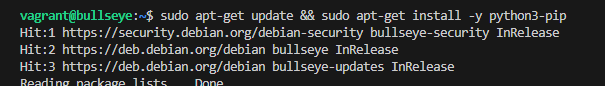
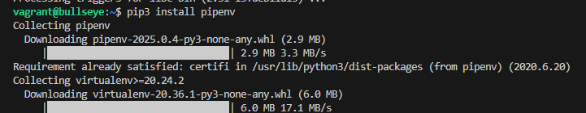
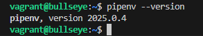
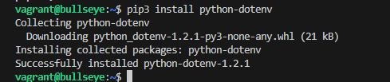
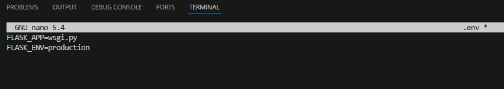
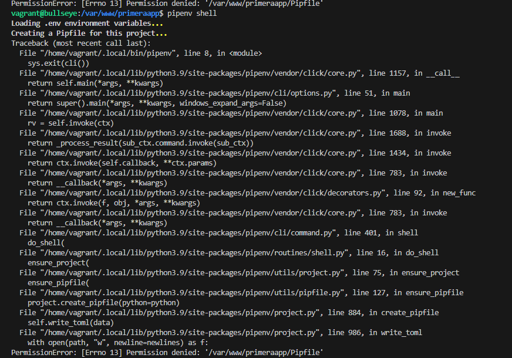
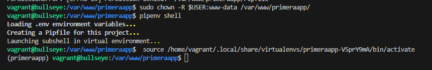

### Usamos de base el ultimo trabajo de tomcat.

# Despliegue de una aplicación Python con Flask y Gunicorn

## Instalacion de python
- Lo primero que tenemos que hacer es instalar el gestor de paquetes de Python. (pip)

- Tambien nos descargamos pipenv para gestionar entornos virtuales.

- Comprobamos que esta instalado bien.

- Lo siguiente es intalarnos python-dotenv para variables de entorno.

## Creacion
- Creamos el directorio de la applicacion. (sudo mkdir -p /var/www/'nombre'), al 
crearla con sudo los permisos son de root lo vamos a cambiar para que pueda ser leido por todos.
(sudo chmod -R 775 /var/www/'nombre')

- Lo siguiente que hay que hacer es crear dentro de /var/www/'nombre' un archivo .env y modificarlo y poner dentro lo sigueinte que son las variables de entrorno,

- Despues de esto iniciamos nuestro entorno virtual 
    - Me estaba dando un error de permisos, y es que no he realizado un chown 
    

